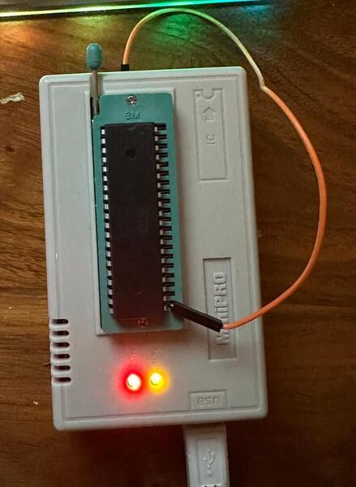
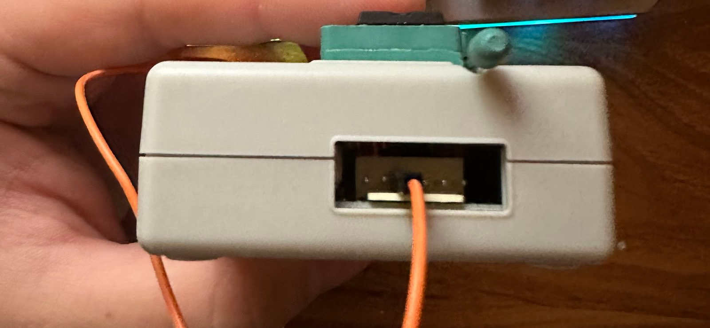

# 6502 Example

This example is a bit unrealistic, because it actually functions without a
Mega866. It uses just one tl866. This example does however use the pin
numbers of the actual "earth" tl866 per the Mega866 schematic. Its goal is to
demonstrate using the `GpioController` class with a simplified hardware setup.

## What it does
This example takes in a 6502 program in the Intel Hex format and allows one to
run it one clock cycle at a time on a real 6502 chip! Note that this must be a
_static_ 6502 design, so that we may run the clock as slow as we'd like. The
main points of interest in `example_6502.py` are the `handle_write` and
`handle_read` functions. In those function, one may define what happens for any
read/write issued by the 6502. In the example as written, an Intel Hex
formatted program is read into a dictionary where keys are addresses and values
are the data at that address. So, the read handler simply looks up addresses in
the map and returns the contents, or 0 if the address is not in the map. For
writing, we simply take the address and datum given and write it into the
memory dictionary, except for address `0x6000`. When we see a write to this
address, we interpret the datum as an ASCII character and write it to the
terminal. The example assembly program continuously writes "Hello world!\n" to
the console.

## Caveats

1. One must currently use a `TL866A` specifically, and no other hardware revision.
2. The `TL866A` must be programmed with the open source firmware provided by
https://github.com/JohnDMcMaster/open-tl866.

## How to insert the 6502 into the TL866

Unfortunately, the TL866 cannot apply VDD/GND to all pins, only particular
ones. And it turns out that the [pinout of the
6502](https://www.westerndesigncenter.com/wdc/documentation/w65c02s.pdf) shows
that the ground pin (VSS, pin 21) does not map to an configurable GND pin on
the TL866. Therefore, we must get creative. If you take a look at [this
image](https://proghq.org/wiki/index.php/File:TL866_ICSP.png), you can see that
we have a GND pin on the side of the TL866. You need to connect this to pin 21
via a jumper wire in order to provide ground. here is a photo:







## How to run the example

1. Install the Python dependencies. This can be done via `pip3 install -r requirements.txt`.
2. Obtain the Vasm assembler. One may obtain it from
[here](http://sun.hasenbraten.de/vasm/). When building, one must select a
target CPU and syntax for the assembler. Here is an example of downloading,
building, and installing Vasm for Linux:
```
tmp=$(mktemp -d)
pushd "$tmp"
curl -O http://sun.hasenbraten.de/vasm/release/vasm.tar.gz
tar xf vasm.tar.gz
    cd vasm
make CPU=6502 SYNTAX=std
cp vasm6502_std "$HOME/bin"
cp vobjdump "$HOME/bin"
popd
```
3. Assemble the example assembly program. Run `vasm6502_std -Fihex
prog_6502.asm -o prog_6502.hex` or use the Makefile: `make`.
4. Plug in a tl866 (with a 6502 inserted) and note its path in `/dev/serial/by-id/usb-ProgHQ_Open...`.
Open `example_6502.py` and look for the instantiation of the `GpioController`
class. Replace the `earth_serial_device` argument with the path to your tl866.
5. Run the example! From the root of the repo, `cd` into `mega866` and run
`python3 -m examples.example_6502.example_6502`.
6. Profit!
